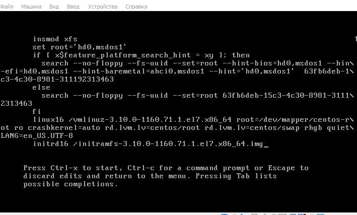
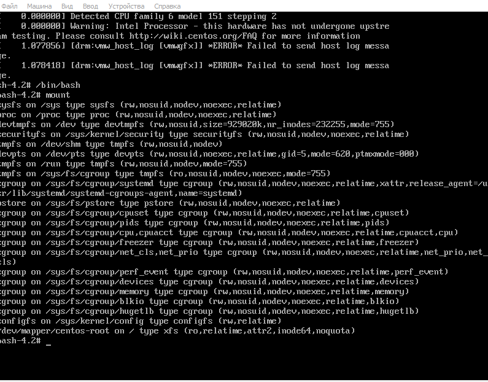
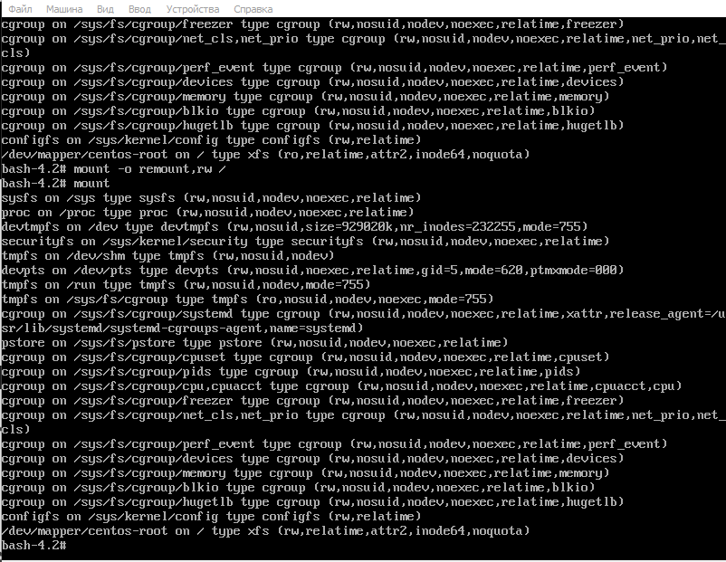
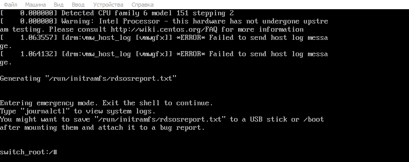
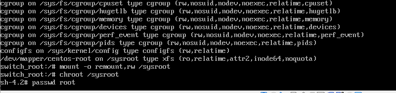
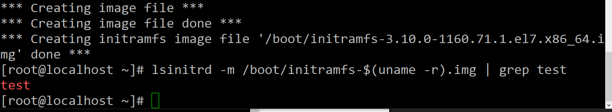
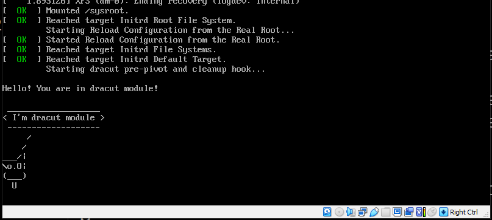

## OTUS Administrator Linux. Professional ДЗ №7: Работа с загрузчиком

**Задание**

1. Попасть в систему без пароля несколькими способами.
2. Установить систему с LVM, после чего переименовать VG.
3. Добавить модуль в initrd.
4. (\*) Сконфигурировать систему без отдельного раздела с /boot, а только с LVM

**Решение**

1.  Без пароля можно попасть в систему, загрузив её в singlemode режиме:

    1. Через дописывание init=/bin/bash к аргументам ядра:
       1. Нажимаем "Е" во время загрузки, попадаем в grub2.
          
       2. Находим строку, начинающуюся с linux16.
       3. Дописываем в её конец init=/bin/bash
       4. Нажимаем Ctrl-X, дожидаемся загрузки.
       5. Попадаем в систему, корень смонтирован в режиме "только чтение"
          
       6. Перемонтируем корень в режим "чтение+запись"
          
    2. Дописыванием rd.break к аргументам ядра:
       1. Аналогично предыдущему способу, см. п. 1-2.
       2. Дописываем rd.break.
       3. Нажимаем Ctrl-x, дожидаемся загрузки.
       4. Попадаем в систему.
          
       5. Перемонтируем корень, и переходим в него.
          

    Приведённые способы отличаются этапом, на котором прерывается обычная загрузка системы. В случае rd.break это происходит на этапе initramfs, в случае init=/bin/bash - после загрузки ядра и initrd. Процедура смены пароля одинакова:

        1. passwd root
        2. touch /.autorelabel
        3. Перезагрузка
        4. Вход под новым паролем.

2.  [Решение в виде typescript](./typescript.md)

3.  Команды приведены в [файле](./initrd.md)
    Вывод команды lsinitrd приведён на скриншоте:
    
    Скриншот процесса загрузки:
    
